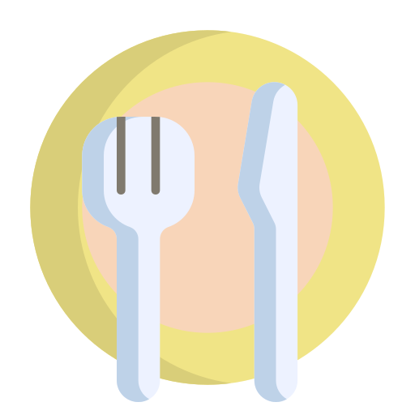

  

      
    
  

  <h1>Menu</h1>
  

  <strong>O Menu é um site simples e funcional, </strong>
   
    projetado para organizar itens de cardápios de maneira prática e intuitiva. 

  
  <strong>
  <a href="#-sobre-o-projeto">Sobre</a>&nbsp;&nbsp;&nbsp;|&nbsp;&nbsp;&nbsp;
  <a href="#-layout">Layout</a>&nbsp;&nbsp;&nbsp;|&nbsp;&nbsp;&nbsp;
  <a href="#-tecnologias">Tecnologias</a>&nbsp;&nbsp;&nbsp;|&nbsp;&nbsp;&nbsp;
  <a href="#-autor">Autor</a>&nbsp;&nbsp;&nbsp;|&nbsp;&nbsp;&nbsp;
  <a href="#-licença">Licença</a>
    </strong>

### 💻 Sobre o Projeto

O [Menu](https://module-chapter-one-menu.vercel.app/) foi criado como um exercício prático de desenvolvimento web, focado em uma interface simples e responsiva para a organização de itens de um cardápio virtual. Através do projeto, foi possível aplicar habilidades de HTML, CSS e JavaScript de forma integrada.

### 📱 Layout

  O projeto está disponível na branch `main`.

> **Tecnologias utilizadas:** **[HTML5](https://html.com/)**, **[CSS3](https://w3.org/Style/CSS/Overview.en.html)**, **[JavaScript](https://www.javascript.com/).**

### 🛠 Tecnologias

As seguintes ferramentas foram usadas no desenvolvimento do projeto Menu:

- **[HTML5](https://html.com/)**
- **[CSS3](https://w3.org/Style/CSS/Overview.en.html)**
- **[JavaScript](https://www.javascript.com/)**

### 🧙‍♂️ Autor

   
     

**Murilo dos Santos**

Conheça mais sobre:

 

### 📄 Licença

Este projeto está sob a [Licença MIT](https://opensource.org/licenses/MIT).
